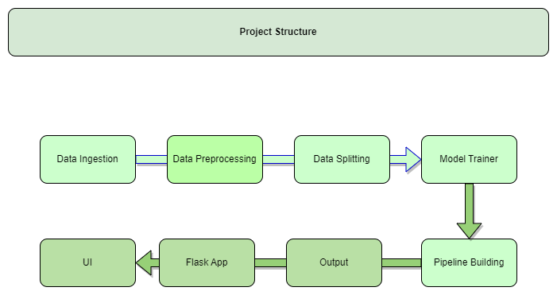
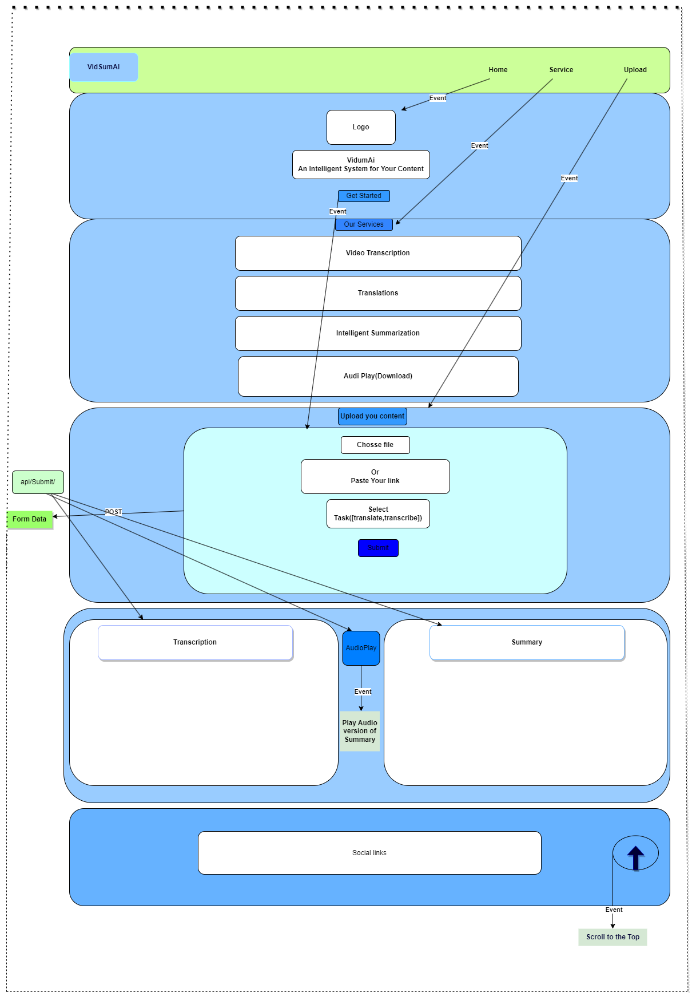

# VidSum-AI
## Project structure

## Project UI

1. Developed a web application for video summarization using Flask and which would transcript and summarize the videos.
2. Used OpenAi Whisper for transcription and **fine-Tuned BART** for Video **summarization** 
3. Evaluated the performance of algorithm using metric  **BLEU and ROUGE** score to campare the performance with state of the art Video summarization Technology
4. Made it easier for users to understand the content of the video with minimal effort
5. Develped a **Audio based** upon the video summary to understnad the evasily our complete summary
6. 
7. 
8. 
9. 
10. 

## Features:
**Video Transcription:** users can upload video files or provide video linkes and our application will transcribe the video into text.

**Translations:** Transcribed Text can be Translated into different languages.

**Summarization:** :application Summarize the Transcribed text to provide a concise overview of the video content,making it easier for users to understand the main content of the video.

**Audio Play:** :users can listen to the summary of Video through text-to-speech conversion ,enhancing user experience

## Future Features inhancement--------------------------------

1.**Keyword Extraction:** A keyword extraction algorithm that can identify important keywords in video.analyze the transcript and extract keyword and convert video into short clips.

2.**Video Segmentation:** we can Develop a mechanism to segment the original video into shorter clips based on keywords. we can split the video where keyword is prominently used.

3.**Clip Summarization:** Summarize the clip that will give user quick overview of clips.

4.**User Interface:** Give user to give keyword and generate clips.

5.**Playlist generation:** Generate a playlist for all the keyword with summarization.

6.**Content selection and RankingK:** Select content and rank them which have more contextually relevent.

7.**User Feedback Loop:** Take user feedback as accuracy and relevent of suggested clips  that can improve algorithm.

8.**Advanced Keyword Matching:** Explore advanced technique like NER to extract specific entities and entities related to keywords.

9.**Fine Tuning and optimization:** Continuous optimization And Fine Tuning.

